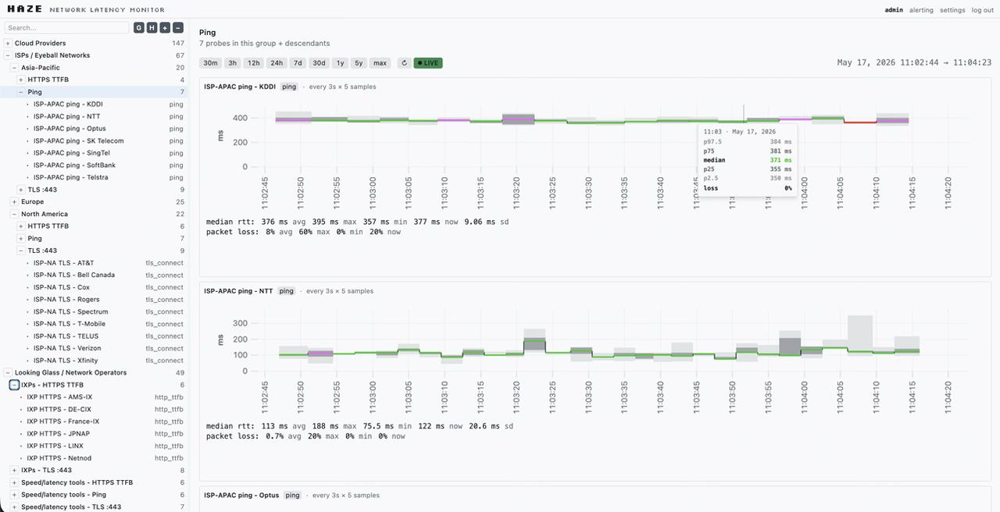

# Haze

<p align="center">
  
</p>

<p align="center">
  A network latency monitor with a smoke-style UI. Probes hosts on a schedule,
  draws the latency distribution as percentile bands whose opacity reflects
  packet loss.
</p>

<p align="center">
  <a href="https://github.com/consi/haze/actions/workflows/test.yml"></a>
  <a href="https://github.com/consi/haze/releases/latest"></a>
  <a href="LICENSE"></a>
  <a href="https://github.com/consi/haze/pkgs/container/haze"></a>
</p>

## Features

- Six probe types:
  - `ping` — ICMP echo round-trip time
  - `dns` — DNS resolution latency
  - `tcp_connect` — TCP handshake time
  - `tls_connect` — TCP + TLS handshake time
  - `http_ttfb` — HTTP request to first response byte
  - `http_total` — HTTP request including body download
- Percentile bands (median + outer envelopes) with packet-loss-driven opacity.
- Multi-host overlay views, per-host detail with alerting hooks.
- Auth via password and `WebAuthn` passkeys (`HAZE_ORIGIN` must be set for passkeys).
- One static binary, frontend assets embedded - no separate webserver.
- SQLite storage; on first boot, an `admin` user is provisioned with a random password printed to logs.

## Install

Pick the format that matches your platform. All artefacts are signed only by GitHub's release attestations; verify with `gh attestation verify` if you need supply-chain assurance.

### Binary

```bash
# Linux amd64
curl -L https://github.com/consi/haze/releases/latest/download/haze-x86_64-unknown-linux-musl -o haze
chmod +x haze
./haze
```

Replace the asset name with `haze-aarch64-unknown-linux-musl` for arm64.

### Debian / Ubuntu

```bash
curl -LO https://github.com/consi/haze/releases/latest/download/haze_<version>_amd64.deb
sudo dpkg -i haze_<version>_amd64.deb
sudo systemctl enable --now haze
journalctl -u haze -f       # grab the admin password printed on first boot
```

### Fedora / RHEL

```bash
sudo rpm -i https://github.com/consi/haze/releases/latest/download/haze-<version>-1.x86_64.rpm
sudo systemctl enable --now haze
journalctl -u haze -f
```

### Docker

```bash
docker run --rm \
    -p 4420:4420 \
    -v haze-data:/var/lib/haze \
    ghcr.io/consi/haze:latest
```

The image is distroless (`gcr.io/distroless/static-debian12:nonroot`) and ships only the static binary. Multi-arch (`linux/amd64`, `linux/arm64`).

## Quick start

1. Run the binary or service. Default bind is `127.0.0.1:4420`; override with `HAZE_BIND=0.0.0.0:4420` (or `--bind`) to expose it on the network.
2. Open <http://localhost:4420>.
3. Sign in as `admin` with the random password **printed to logs on first boot**.
4. Add a host: pick a target, choose a probe type, set the interval.
5. Watch the smoke chart fill in.

## Configuration

| Variable          | Default              | Notes                                                                                |
|-------------------|----------------------|--------------------------------------------------------------------------------------|
| `HAZE_BIND`       | `127.0.0.1:4420`     | Bind address. Use `0.0.0.0:4420` to listen on all interfaces.                        |
| `HAZE_DATA_DIR`   | `./data` (binary), `/var/lib/haze` (systemd) | SQLite database and probe chunk files (HZC).              |
| `HAZE_LOG`        | `info`               | `tracing-subscriber` directive, e.g. `haze=debug,info`.                              |
| `HAZE_ORIGIN`     | _unset_              | Public origin (`https://haze.example.com`) — required for WebAuthn passkeys.         |

CLI flags mirror the env vars (`--bind`, `--data-dir`, `--log`, `--origin`).

## Building from source

You need a recent stable Rust toolchain (the `rust-toolchain.toml` pins `stable`), Node.js 22+, and [`just`](https://github.com/casey/just) for the orchestration recipes.

```bash
just setup       # cargo fetch + npm ci
just dev         # prints the two commands to run in parallel terminals
just release     # builds frontend, then a single binary at target/release/haze
```

To cross-compile static musl binaries the same way the release workflow does:

```bash
just setup-tools                                 # installs cargo-zigbuild etc.
cargo zigbuild --release --target x86_64-unknown-linux-musl -p haze-cli
cargo zigbuild --release --target aarch64-unknown-linux-musl -p haze-cli
```

## License

[AGPL-3.0-or-later](LICENSE). If you run Haze on a network-accessible service, the AGPL's network-use clause applies — you must offer the source to users of that service.
